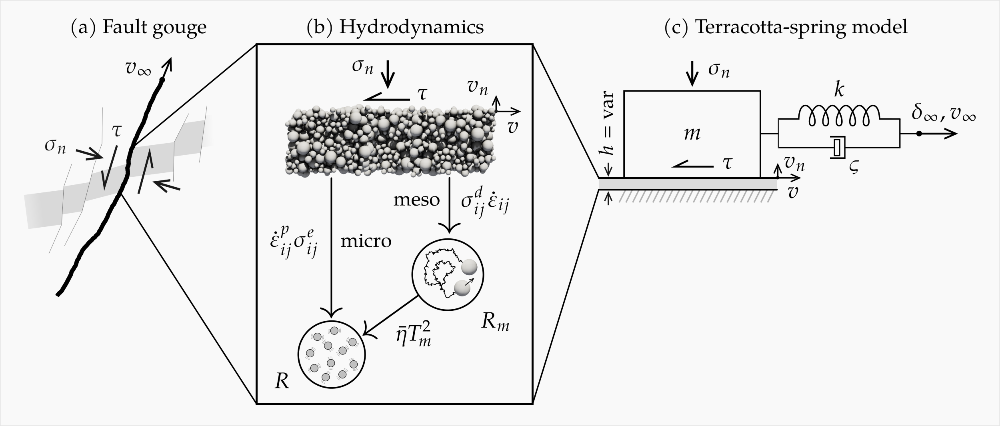

## Hydrodynamics of fault gouges from constitutive modelling to the physics of friction

### Abstract

The development of rate- and state-dependent friction laws offered important insights into the key physical mechanisms of the frictional behaviour of fault gouges and their seismic cycle. However, past approaches were specifically tailored to address the problem of fault shearing, leaving questions about their ability to comprehensively represent the gouge material under general loading conditions.
This work establishes an alternative approach for developing a physical friction law for fault gouges that is grounded on the rigour of the hydrodynamic procedure with two-scale temperatures through Terracotta, a thoroughly robust constitutive model for clay in triaxial loading conditions. By specifying the model for direct shearing, the approach yields an alternative friction law that readily captures the frictional dynamics of fault gouges, including explicit dependencies on gouge layer thickness, normal stress, and solid fraction. Validated against available laboratory experiments, the friction law retains the original predictive capabilities of Terracotta in triaxial conditions and explains the rate-and-state, dilatational behaviour of fault gouges in direct shear conditions. Finally, when the Terracotta friction law is connected to a spring-dashpot representation of the host rock, the combined model predicts an elastic buildup precursor to the onset of and subsequent seismicity, with results closely reflecting experimental evidence and field observations.
While this study focuses on clay-rich gouges, the approach and findings are expected to offer much wider implications to a variety of materials.

### References

If you use this code, please cite the related paper and this repository:

F Masi, I Einav (2024). "[Hydrodynamics of fault gouges from constitutive modelling to the physics of friction](https://doi.org/10.48550/arXiv.2411.14660)". arXiv:2411.14660 [physics.geo-ph]

  @article{masi_einav_hydrodynamics,
    title={Hydrodynamics of fault gouges from constitutive modelling to the physics of friction},
    author={Masi, Filippo and Einav, Itai},
    journal={arXiv preprint arXiv:2411.14660},
    year={2024},
    doi={[https://doi.org/10.48550/arXiv.2312.01666](https://doi.org/10.48550/arXiv.2411.14660)}
  }

